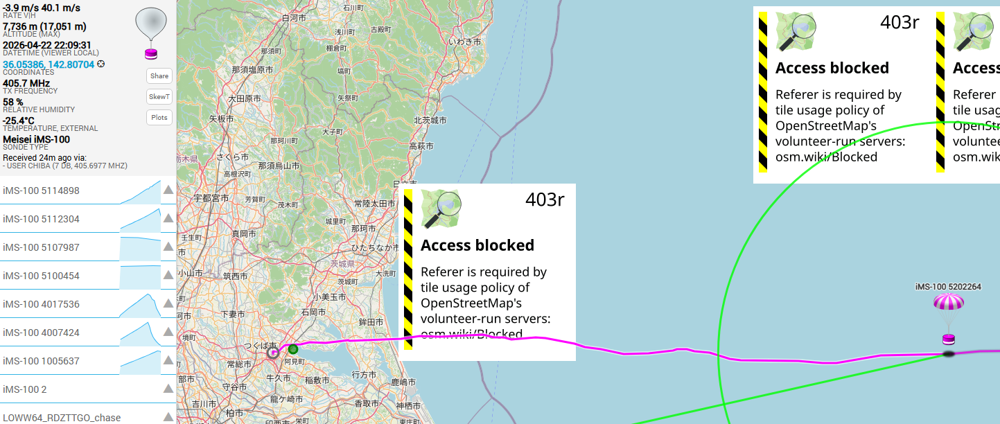
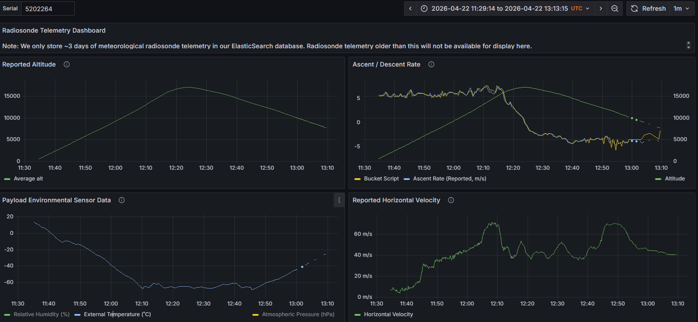
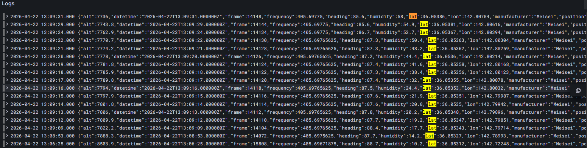
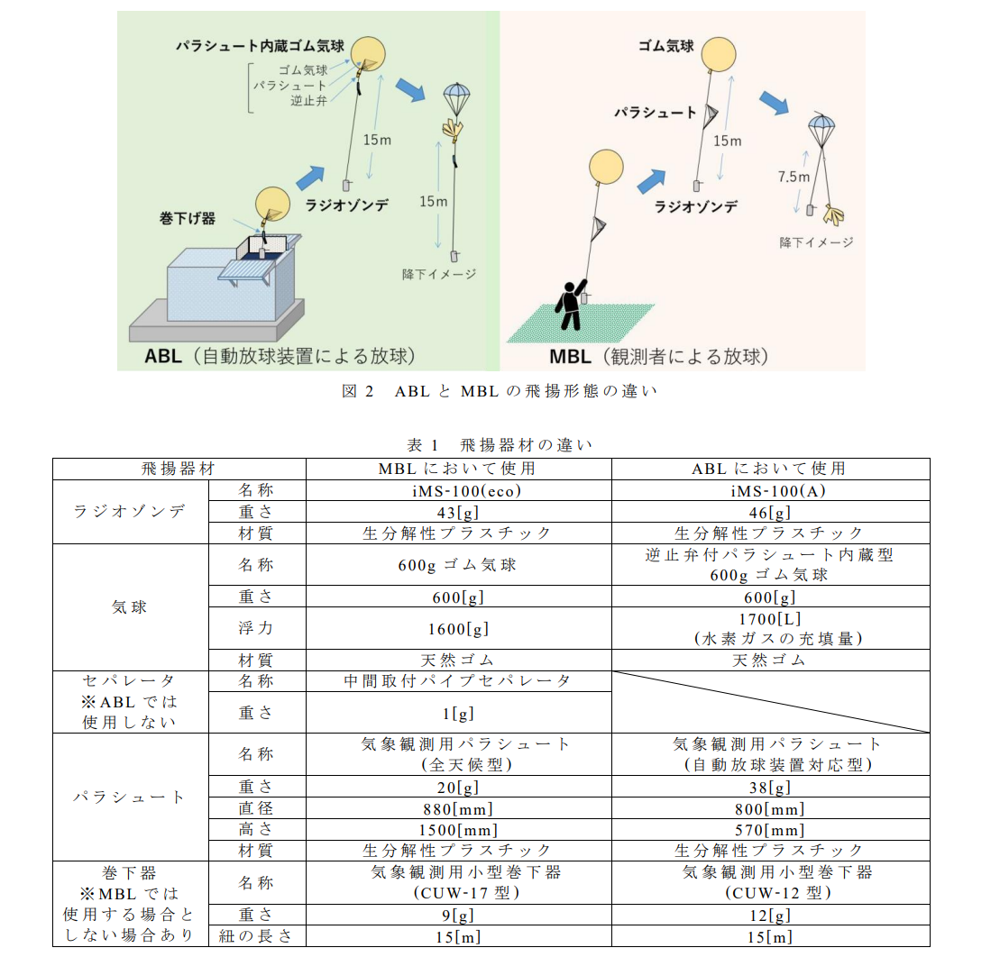

# Note(調べた情報を備忘録的にstock)
## 1.検証データについて
### 1.1 気球のフライトデータ(生データ)
科学気球のフライトデータを記録しているサイトを見つけた.

Sonde Hub Tracker (https://sondehub.org/)

日本のつくばから飛び立った気球のデータがある.

IMS-100 5202264

grafanaでデータが見れる

ただし三日でデータが消える模様なので,以下をダウンロードした.

- 高度
- 温度
- Ascent / Decent Rate(おそらく高度方向の速度)
- Reported Horizontal velocity(水平方向速度)

以下はデータが存在しなかった.
- 気圧(hPa)
- 緯度経度

(追記)

生logがあった.

生ログの中にはlat/lonが含まれているので,こちらで水平方向のシミュレーション検証にも使えそうである.

以下に保存した.

data/Logs-logs-2026-04-22 23_13_51.txt

なおaltitudeについては7700 [m]ほどでデータが途絶えている.

しかし回収地点と思われる位置は地図から読み取れた.

風速については1枚目から見れるが,定数となっている.

しかし飛翔時刻わかるので,後で当該時刻の気象データを検索できるかもしれない.

時系列のプロットデータで,高度ごとにレイヤー分けされた風速データがある(GPT)

これを探す必要があるのと,実運用的には予報データが必要.

### 1.2 気球のconfigデータ

上記はMeisei iMS-100という気球を使用している.

名前から察するに明星電機様の気球と推測される.

ユーザ向け仕様書を見つけた.

https://www.meisei.co.jp/products/meteo/meteo_high_ground/p578

https://www.meisei.co.jp/wp-content/uploads/2020/04/iMS-100.pdf

関連する論文(技術資料)を見つけた

https://www.jma-net.go.jp/kousou/information/journal/2023/pdf/78_21_Kobayashi.pdf

https://www.jma-net.go.jp/kousou/information/journal/2026_81/pdf/81_Sakamoto_et.pdf

気球の諸元を見つけた.

若干パラメータが異なる.

ABLなのかMBLなのかHUBのデータからは不明だが,両方試して近い方という推定はできるかもしれない.

質量,浮力,パラシュートサイズがわかるのでシミュレートはできるはず.

気球の破裂条件が不明(個体値依存も高そう)であるが,何かしら推定方法はあるのかもしれないので要調査.