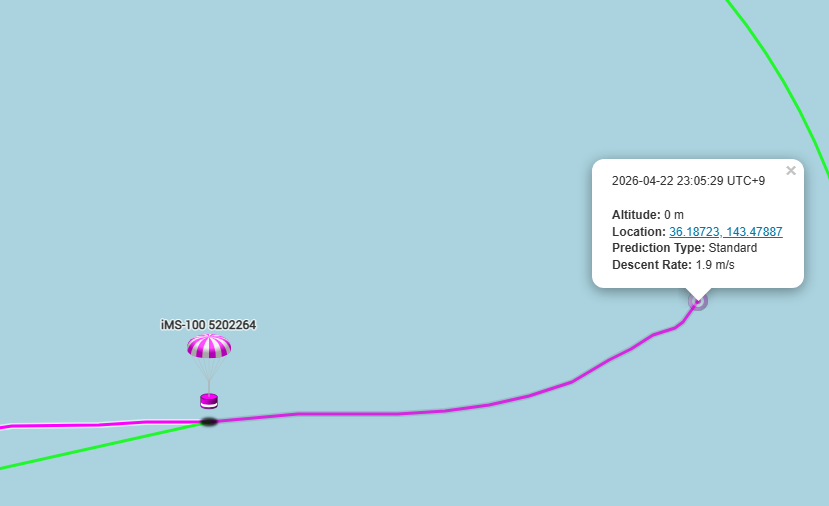

# Note(調べた情報を備忘録的にstock)
## 1.検証データについて
### 1.1 気球のフライトデータ(生データ)
科学気球のフライトデータを記録しているサイトを見つけた.

Sonde Hub Tracker (https://sondehub.org/)

日本のつくばから飛び立った気球のデータがある.

IMS-100 5202264


grafanaでデータが見れる


ただし三日でデータが消える模様なので,以下をダウンロードした.

- 高度
- 温度
- Ascent / Decent Rate(おそらく高度方向の速度)
- Reported Horizontal velocity(水平方向速度)

以下はデータが存在しなかった.
- 気圧(hPa)
- 緯度経度

(追記)

生logがあった.

生ログの中にはlat/lonが含まれているので,こちらで水平方向のシミュレーション検証にも使えそうである.


以下に保存した.

data/Logs-logs-2026-04-22 23_13_51.txt

なおaltitudeについては7700 [m]ほどでデータが途絶えている.

しかし回収地点と思われる位置は地図から読み取れた.


風速については1枚目から見れるが,定数となっている.

しかし飛翔時刻わかるので,後で当該時刻の気象データを検索できるかもしれない.

時系列のプロットデータで,高度ごとにレイヤー分けされた風速データがある(GPT)

これを探す必要があるのと,実運用的には予報データが必要.


### 1.2 気球のconfigデータ

上記はMeisei iMS-100という気球を使用している.

名前から察するに明星電機様の気球と推測される.

ユーザ向け仕様書を見つけた.

https://www.meisei.co.jp/products/meteo/meteo_high_ground/p578

https://www.meisei.co.jp/wp-content/uploads/2020/04/iMS-100.pdf

関連する論文(技術資料)を見つけた

https://www.jma-net.go.jp/kousou/information/journal/2023/pdf/78_21_Kobayashi.pdf

https://www.jma-net.go.jp/kousou/information/journal/2026_81/pdf/81_Sakamoto_et.pdf

気球の諸元を見つけた.


若干パラメータが異なる.

ABLなのかMBLなのかHUBのデータからは不明だが,両方試して近い方という推定はできるかもしれない.

質量,浮力,パラシュートサイズがわかるのでシミュレートはできるはず.

気球の破裂条件が不明(個体値依存も高そう)であるが,何かしら推定方法はあるのかもしれないので要調査.

### 1.3 気象データ

検証や運用で使えそうな気象データは以下
#### 1.3.1 (過去の観測データ)ERA5 hourly data on pressure levels from 1940 to present
- https://cds.climate.copernicus.eu/datasets/reanalysis-era5-pressure-levels?tab=download
- 過去の観測データ
- 高度の代わりにhPaで分層されている uが水平方向(東西)の風力 vが垂直方向(南北)の風力
- ERA5 のデータ可視化をpythonで実施しているサイトがあった
- https://note.com/ats030/n/nfd8b40e1d066
- 過去データなので基本的にはツールの計算精度検証に使える

中身の確認

緯度経度と風速
```bash
grib_get_data ./data/7fe18575e9317a74d53961f4295927a4.grib | head
Latitude Longitude Value
   40.000  134.000 2.7898071289e+01
   40.000  134.250 2.7999633789e+01
   40.000  134.500 2.8114868164e+01
   40.000  134.750 2.8237915039e+01
   40.000  135.000 2.8353149414e+01
   40.000  135.250 2.8452758789e+01
   40.000  135.500 2.8519165039e+01
   40.000  135.750 2.8542602539e+01
   40.000  136.000 2.8521118164e+01
```

#### 1.3.2 (将来予報) GFS
- https://registry.opendata.aws/noaa-gfs-bdp-pds/
- Brouwse BucketからAWSサーバにアクセスし,右上でgfs.YYYYMMDD(ex. gfs.20260423)を入力
- YYYYMMDDはプロダクトの日にちではなく,予報した日付
- 目的は atom →　gfs.t06z.pgrb2.0p25.f072 t06は作成した時刻 00,06,12,18がある

中身の確認

高度層とデータ
```bash
grib_get -p shortName,name,typeOfLevel,level,stepRange gfs.t06z.pgrb2.0p25.f072 | grep -E '^(u|v) '
u U component of wind planetaryBoundaryLayer 0 72
v V component of wind planetaryBoundaryLayer 0 72
u U component of wind isobaricInPa 1 72
v V component of wind isobaricInPa 1 72
u U component of wind isobaricInPa 2 72
v V component of wind isobaricInPa 2 72
u U component of wind isobaricInPa 4 72
v V component of wind isobaricInPa 4 72
u U component of wind isobaricInPa 7 72
```

緯度経度と風速
```bash
 grib_get_data gfs.t06z.pgrb2.0p25.f072 | head
Latitude Longitude Value
   90.000    0.000 1.0228976250e+05
   90.000    0.250 1.0228976250e+05
   90.000    0.500 1.0228976250e+05
   90.000    0.750 1.0228976250e+05
   90.000    1.000 1.0228976250e+05
   90.000    1.250 1.0228976250e+05
   90.000    1.500 1.0228976250e+05
   90.000    1.750 1.0228976250e+05
   90.000    2.000 1.0228976250e+05
```